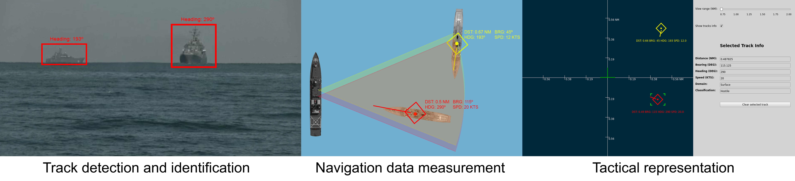
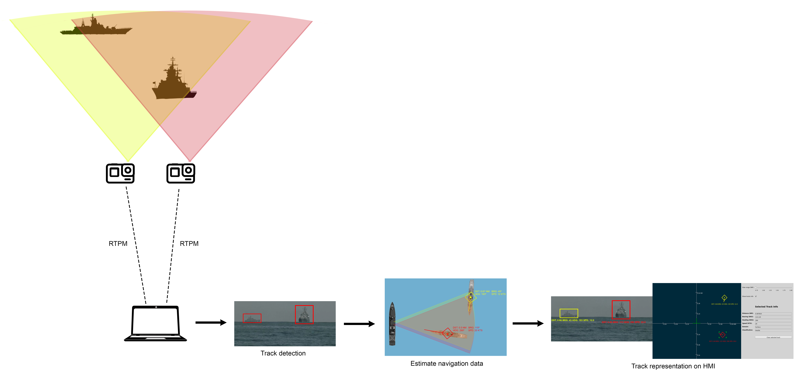
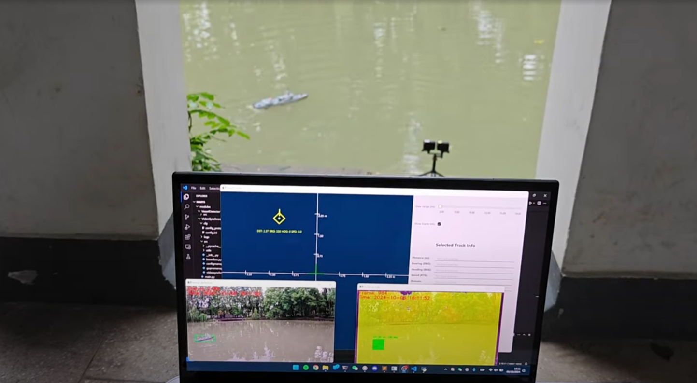
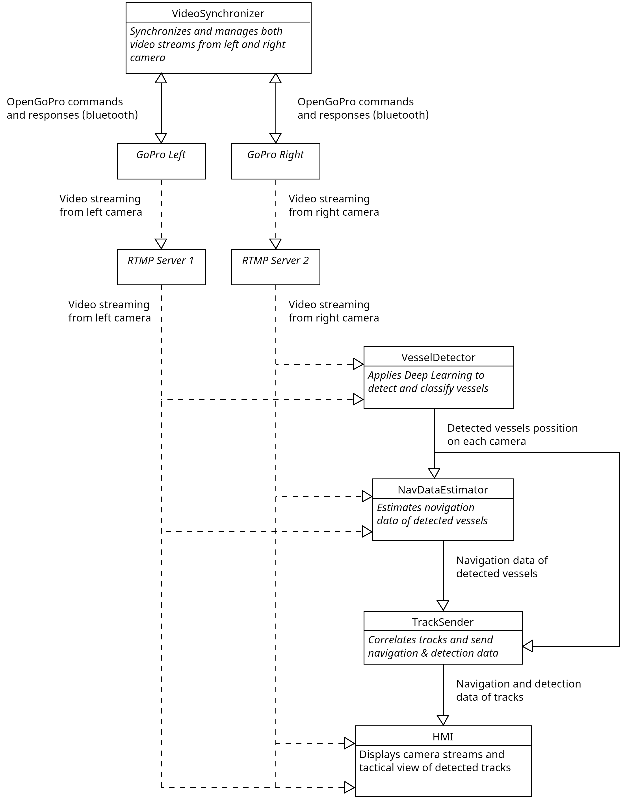

# MADTS
MADTS (**Maritime Auxiliary Detection and Tracking System**) is an auxiliary system for ships that enables the detection and identification of marine traces using pairs of cameras. It also estimates relevant navigation data (heading, distance, speed, friend or foe) making use of stereoscopic vision and displays the data on a tactical HMI.



## Features
* **Vessel detection:** Apply Deep Learning model to detect vessels.
* **Vessel identification:** Classify detected vessel as friend or foe based on its class and behavior.
* **Navigation data estimation:** Estimate key navigation data (heading, distance, speed, friend or foe).
* **Tactical representation:** Display tracks and their estimated navigation data on a tactical Human-Machine Interface.

## Tentative Features
* **Drone detection:** Detect, track and display drones and their navigation data.
* **Tracker:** Track history, track management, track correlation.
* **Enhanced behavior analyzer:** Classify tracks as friend or foe according to their behavior.

## Project Limitations
Due to time, budget, and resource constraints, two *GoPro HERO 10 Black* cameras will be mounted along a radio-controlled warship, which will act as the ownship where **MADTS** will be executed. Other radio-controlled warships and civilian ships will be used for detection and identification.





## Architecture
The architecture of MADTS is microservices-based and consists of the following modules:
* **RTMP Servers:** Two RTMP servers that receive the video stream from two *GoPro HERO 10 Black*.
* **VideoSynchronizer:** Uses **OpenGoPro API** to manage and synchronize both video streams.
* **VesselDetector:** Applies Deep Learning to detect and classify vessels.
* **NavDataEstimator:** Estimates navigation data of detected vessels (heading, speed, distance, friend or foe).
* **TrackSender:** Emits track navigation data.
* **Human-Machine Interface:** Displays camera streams and tactical view of detected tracks.



## Modules
TBD. Here goes the description of each module that composes MADTS.

## Communications
TBD. Here goes the desciption of communication between the modules.

### VesselDetector

|  **Field**  | **Type** | **Values** | **Num bytes** | **endianess** |
|:-----------:|:--------:|:----------:|:-------------:|:-------------:|
| point_x     | float    | [0, 1]     | 1             | Little-endian |
| point_y     | float    | [0, 1]     | 1             | Little-endian |
| width       | float    | [0, 1]     | 1             | Little-endian |
| height      | float    | [0, 1]     | 1             | Little-endian |
| class       | int      | [0, 1]     | 1             | Big-endian    |
| probability | float    | [0, 1]     | 1             | Little-endian |

* **point_x:** X position (x) of detected vessel (relative to image).
* **point_y:** Y position (y) of detected vessel (relative to image).
* **width:** Bounding box width of detected vessel (relative to image).
* **height:** Bounding box height of detected vessel (relative to image).
* **class:** Class of detected vessel (0 -> Civil; 1 -> Warship).
* **probability:** Probability of detection.

### NavDataEstimator

| **Field** | **Type** | **Values** | **Num bytes** | **endianess** |
|:---------:|:--------:|:----------:|:-------------:|:-------------:|
| distance  | float    | [0, 18520] | 2             | Little-endian |
| bearing   | int      | [0, 360]   | 2             | Big-endian    |
| heading   | int      | [0, 360]   | 2             | Big-endian    |
| speed     | float    | [0, 999]   | 2             | Little-endian |
| behavior  | int      | [0, 2]     | 1             | Big-endian    |

* **distance:** Distance from detected vessel to ownship (meters).
* **bearing:** Bearing of detected vessel (decimal degrees).
* **heading:** True heading of detected vessel (decimal degrees).
* **speed:** Speed of detected vessel (knots).
* **behavior:** 0 -> ALLY, 1 -> HOSTILE, 2 -> UNKNOWN.

### TrackSender

|  **Field**  | **Type** | **Values** | **Num bytes** | **endianess** |
|:-----------:|:--------:|:----------:|:-------------:|:-------------:|
| id          | int      | [0, 999]   | 2             | Big-endian    |
| distance    | float    | [0, 18520] | 2             | Little-endian |
| bearing     | int      | [0, 360]   | 2             | Big-endian    |
| heading     | int      | [0, 360]   | 2             | Big-endian    |
| speed       | float    | [0, 999]   | 2             | Little-endian |
| behavior    | int      | [0, 2]     | 1             | Big-endian    |
| point_x     | float    | [0, 1]     | 1             | Little-endian |
| point_y     | float    | [0, 1]     | 1             | Little-endian |
| width       | float    | [0, 1]     | 1             | Little-endian |
| height      | float    | [0, 1]     | 1             | Little-endian |
| class       | int      | [0, 1]     | 1             | Big-endian    |
| probability | float    | [0, 1]     | 1             | Little-endian |

* **id:** Track id.
* **distance:** Distance from track to ownship (meters).
* **bearing:** Track bearing (decimal degrees).
* **heading:** Track true heading (decimal degrees).
* **speed:** Track speed (knots).
* **behavior:** 0 -> ALLY, 1 -> HOSTILE, 2 -> UNKNOWN.
* **point_x:** X position (x) of track (relative to image).
* **point_y:** Y position (y) of track (relative to image).
* **width:** Bounding box width of track (relative to image).
* **height:** Bounding box height of track (relative to image).
* **class:** Class of track (0 -> Civil; 1 -> Warship).
* **probability:** Probability of detection.

## Installation
TBD. Here goes installation instructions.

## RTMP Server

```
sudo chown -R nobody:nogroup /streams/*
```

Configuration used:
```
rtmp {
        server {
                listen 1935;
                chunk_size 4096;
                notify_method get;

                application gopro_left {
                            live on;
                            #Set this to "record off" if you don't want to save a copy of your broadcasts
                            record video;
                            #The directory in which the recordings will be stored
                            record_path /streams/left/;
                            record_unique on;
                }

                application gopro_right {
                            live on;
                            #Set this to "record off" if you don't want to save a copy of your broadcasts
                            record video;
                            #The directory in which the recordings will be stored
                            record_path /streams/right/;
                            record_unique on;
                }
        }

   }
```

## Usage
TBD. Here goes usage instructions.

## References
TBD. Here goes citations and references.
