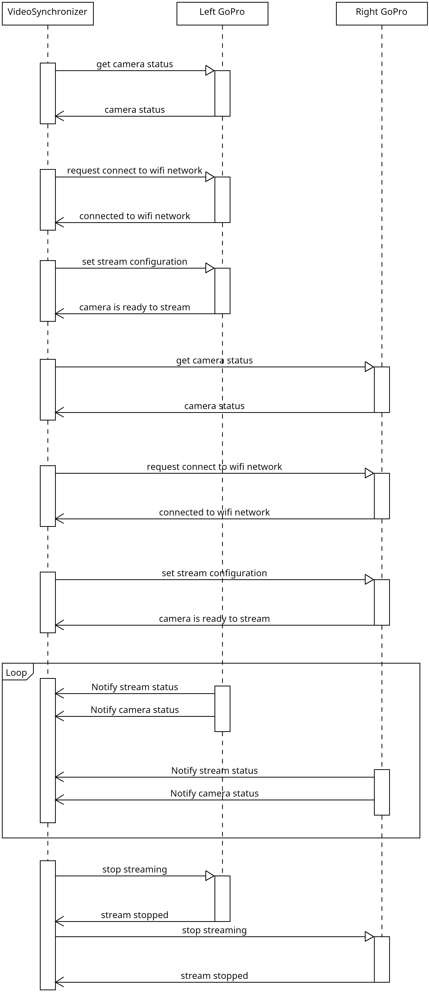

# VideoSynchronizer

VideoSynchronizer module is in charge of managing GoPros settings, stablishing connection between RTMP server and them, receiving GoPros video streams managing streaming and synchronizing both
streams, allowing *VesselDetector* module acces to it.

## Modules

- **BaseClass:** Base class from which all classes inherit common logger.
- **ConfigManager:** Singleton class that allows reading configuration file, ensuring a single, consistent source of configuration data across the application.
- **GoProManager:** Class in charge of managing everything related to GoPro: from connecting the module to them, to synchronizing both streamings.
- **VideoSynchronizer:** Main class that manages and coordinate all modules.

## Configuration

Configuration file has several sections to organize each parameter:
- **RTMP_SERVER:**
    - **gopro_left_url (str):** RTMP url from which receive left Go Pro streaming (e.g.: *rtmp://192.168.1.133/gopro1*).
    - **gopro_right_url (str):** RTMP url from which receive right Go Pro streaming (e.g.: *rtmp://192.168.1.133/gopro2*).
    - **network_ssid (str):** SSID of the network where the RTMP server is located. (e.g.: *WifiName123*).
    - **network_password (str):** Password of the network where the RTMP server is located. (e.g.: *Password123*).

- **GOPRO_MANAGEMENT:**
    - **gopro_left_name (str):** Left Go Pro identifier, should follow the format **GoPro XXXX** (e.g. *GoPro 2412*).
    - **gopro_right_name (str):** Right Go Pro identifier, should follow the format **GoPro XXXX** (e.g. *GoPro 1921*).
    - **record_stream (int):** Enable recording while streaming (**1**) or disable it (**0**).

- **STREAM*:*
    - **resolution (int):** Streaming resolution. Accepted values:
        - **0:** Stream in 480p. 
        - **1:** Stream in 720. 
        - **2:** Stream in 1080p. 
    - **min_bitrate (int):** Minimum desired bitrate. Must be higher or equal to **800**, if not, 800 will be used.
    - **max_bitrate (int):** Maximum desired bitrate. Must be less or equal to **8000**, if not, 8000 will be used.
    - **starting_bitrate (int):** Starting bitrate. Must be higher or equal to **800** and less or equal to **8000**, if not, the closest value (800 or 8000) will be used.
    - **fov (int):** Common Video Field of View values. Accepted values:
        - **0:** WIDE FOV. 
        - **1:** LINEAR FOV. 
        - **2:** SUPERVIEW FOV. 
    - **fps (int):** TBD
    - **duration (int):** TBD
    - **hypersmooth (int):** TBD

## How it works

VideoSynchronizer module uses [OpenGoPro API](https://github.com/gopro/OpenGoPro) to connect to and manage both GoPro. 

Note: As a single client is used to connect to two different GoPro, only BLE commands are used (connecting the client to two different APs would add too much complexity).

The general workflow is the following:

1. Left GoPro advertises itself through bluetooth.
2. Right GoPro advertises itself through bluetooth.
3. VideoSynchronizer scans avaliable bluetooth devices and, after finding Left GoPro, connects to it.
4. VideoSynchronizer obtains Left GoPro status to verify that the connection has be stablished.
5. VideoSynchronizer connects Left GoPro to configured network (should be the same as the RTMP server is located).
6. VideoSynchronizer sets up Left GoPro's streaming configuration according to the configuration file.
7. VideoSynchronizer waits till Left GoPro is ready to start streaming.
8. VideoSynchronizer scans avaliable bluetooth devices and, after finding Right GoPro, connects to it.
9. VideoSynchronizer obtains Right GoPro status to verify that the connection has be stablished.
10. VideoSynchronizer connects Right GoPro to configured network (should be the same as the RTMP server is located).
11. VideoSynchronizer sets up Right GoPro's streaming configuration according to the configuration file.
12. VideoSynchronizer waits till Right GoPro is ready to start streaming.
13. VideoSynchronizer starts both Left and Right GoPro streaming.

## Considerations

- In order to communicate the client to the GoPro, the GoPro must be on pairing mode: *Settings* > *Connect Device* > *GoPro Quik App*.
- As communication between VideoSynchronizer and GoPros is made through bluetooth, the distance between them could be very short.
- BLE communication frequently raises errors (e.g. *WinError -2147023673*, scanning for device timeout, etc.), a method that seems to *help* with these issues is to connect the GoPro to the mobile app, *GoPro Quik* and then reconnect the client to the GoPro. 